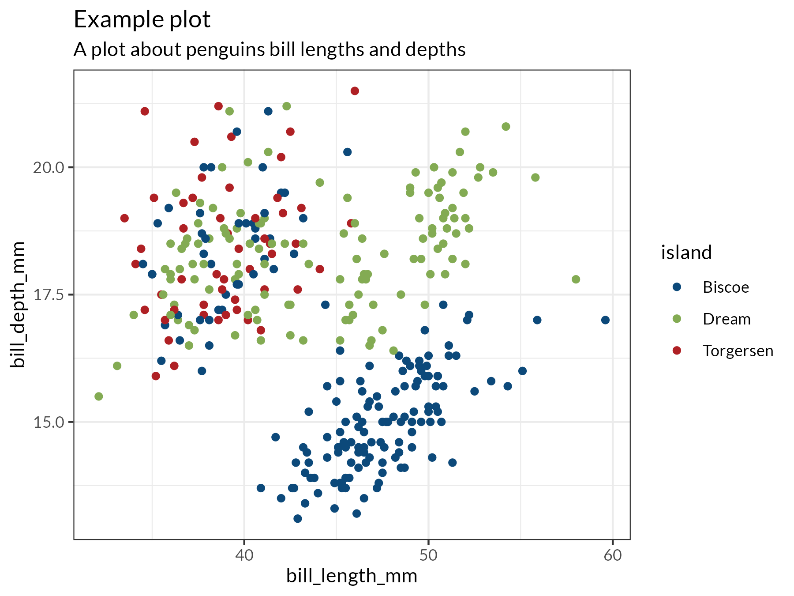

# R Functions for the Canadian Digital Service

This repository provides some simple R functions to make doing CDS-style
analyses easier. It includes:

* a standard CDS theme for ggplot2 (`cds::theme_cds()`)
* a function to help resolve non-standard organisation names (`cds::resolve_name()`)
* a list of commonly used colors (`cds::colors`)
* a list of commonly used colours (`cds::colours`)

<!-- badges: start -->
  [](https://github.com/cds-snc/data-r-functions-for-cds/actions/workflows/R-CMD-check.yaml)
<!-- badges: end -->

## Installation

Install the package directly from Github, using the `devtools` package:

```
if(!require("devtools")) install.packages("devtools")
devtools::install_github("cds-snc/data-r-functions-for-cds")
```

## CDS-Style Figures

Recommended CDS color palettes are built into the package, as well as a ggplot2 
theme that tries to follow CDS's style guidelines for figures.

```
library(ggplot2)

palmerpenguins::penguins |>
  ggplot(aes(
    x = bill_length_mm, 
    y = bill_depth_mm,
    color = island
    )) +
  geom_point() +
  scale_color_manual(values = cds::colors$primary[c(2,4,5)]) +
  theme_bw() +
  cds::theme_cds() +
  ggtitle("Example plot", subtitle = "A plot about penguins bill lengths and depths")
```




## Organisation Name Resolution

Names of federal departments or agencies are hard. They change often, there are
French and English versions, and everyone seems to abbreviate them differently.
The `resolve_name()` function in this package takes a vector of strings
representing names of federal departments or agencies and tries to resolve them
into the [official names](https://github.com/cds-snc/gc-organisations/), using
name standardization, fuzzy joins and some ugly heuristics.

```
> cds::resolve_name(c(
    "IRCC", 
    "ESDC", 
    "Natural Resources", 
    "tpsgc-pwgsc.gc.ca", 
    "Department of Unicorns"
    ))

[1] "Immigration, Refugees and Citizenship Canada" "Employment and Social Development Canada"    
[3] "Natural Resources Canada"                     "Public Services and Procurement Canada"      
[5] NA                                            
Warning message:
  1 names couldn't be matched:
   "Department of Unicorns"

```

## Package Tests

Tests for this package are included, built in the `testthat` framework. To run
them, clone this repository, open the project in R Studio, and ensure that the 
`testthat` package is installed. Then, run `devtools::test()`

```
==> devtools::test()

ℹ Testing cds
✔ | F W  S  OK | Context
✔ |          8 | normalize_name                                                              
✔ |          4 | org_resolver                                                                
✔ |         21 | resolve_name                                                                

══ Results ══════════════════════════════════════════════════════════════════════════════════
[ FAIL 0 | WARN 0 | SKIP 0 | PASS 33 ]
```
